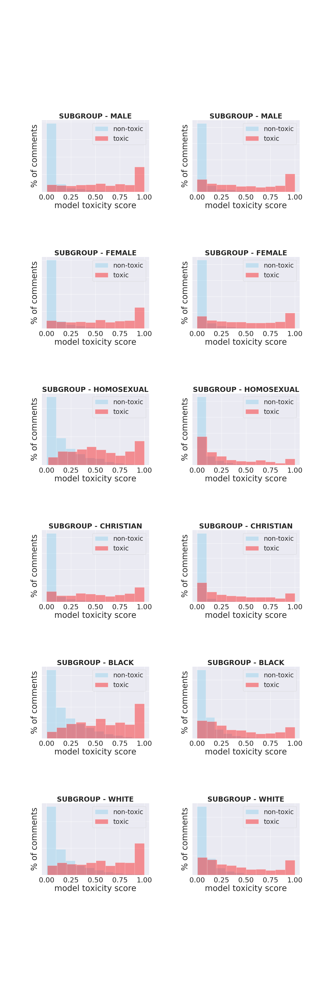

# Debiasing Personal Identities in Toxicity Classification

As Machine Learning models continue to be relied upon for making automated decisions, the issue of model bias becomes more and more prevalent. In this project, we approach training a text classification model and optimize on bias minimization by measuring not only the models performance on our dataset as a whole, but also how it performs across different subgroups. This requires measuring performance independently for different demographic subgroups and measuring bias bycomparing them to results from the rest of our data. We show how unintended bias can be detected using these metrics and how removing bias from a dataset completely can result in worse results.

## Data:

For this project, we used data from [Jigsaw Unintended Bias in Toxicity Classification](https://www.kaggle.com/c/jigsaw-unintended-bias-in-toxicity-classification/overview) competition from Kaggle platform.
* [Train_data](https://www.kaggle.com/c/jigsaw-unintended-bias-in-toxicity-classification/download/train.csv) contains 1.8 million **comments** labeled with toxicity score from 0 to 1. The data also contains columns to indicate if a comment has any peronal identity information along with other auxillary columns.
* [Test_data](https://www.kaggle.com/c/jigsaw-unintended-bias-in-toxicity-classification/download/test.csv) contains 97.3K comments with a unique identifier for each comment. 

## Models:

### 1. [TF-IDF](Jigsaw_TFIDF_LSTM.ipynb): 
In this model, we have used term frequency-inverse document frequency for calculating the weights of each word in the comments and then applied logistic regression to predict the comments' toxicity. This model has no contextual information to differentiate comments from non-toxic to toxic.

### 2. [LSTM](Jigsaw_TFIDF_LSTM.ipynb): 
In this model, we have used a special kind of Recurrent Neural Network known as Long Short Term Memory networks to predict the toxicity of the comments. For vocabulary embeddings, we have used [GloVe](https://nlp.stanford.edu/projects/glove/) with 6 billion tokens, 400K vocaublary and 50 dimensional vectors which is trained on Wikipedia and Gigaword. 

### 3. [BERT Mixed](Jigsaw_BERT_Mixed.ipynb): 
In this model, we used a pre-trained  base  uncased model. The model’s architecture consists of ElMo embeddings, 12 layers, 768 hidden states, 12 heads and  110M  parameters.  We  used the bertForSequenceClassification class of the pre-trained BERT model to fine tune the parameters for text classification. The data(comments) used for training this model includes personal identity subgroups. 

### 4. [BERT Naïve](Jigsaw_BERT_Naïve.ipynb): 
In this model, we used a pre-trained  base  uncased model. The model’s architecture consists of ElMo embeddings, 12 layers, 768 hidden states, 12 heads and  110M  parameters.  We  used the bertForSequenceClassification class of the pre-trained BERT model to fine tune the parameters for text classification. The data(comments) used for training this model does not include any personal identity subgroups. This models has never seen a comment that contains personal identites.

## Results and EDA:

In [Jigsaw_BERT_EDA.ipynb](Jigsaw_BERT_EDA.ipynb), we have performed EDA on the AUC results of both *BERT_Mixed* and *BERT_Naïve* models. We can see below how the models perfomed on different subgroups.

##            BERT_Mixed                            BERT_Naïve             

